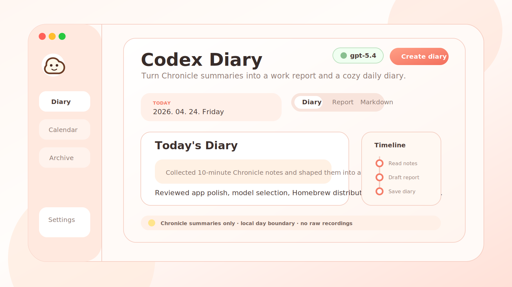
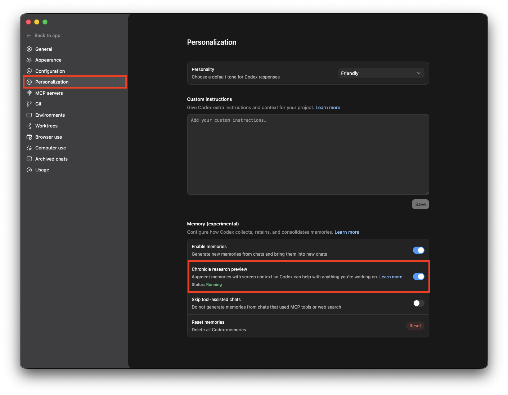

[English](README.md) | [한국어](README.ko.md) | [日本語](README.ja.md) | [中文](README.zh.md)

# codex-diary

## First: Enable Chronicle

Codex Diary reads Chronicle Markdown summaries, so turn on `Chronicle research preview` in Codex before creating diaries.



## Install with Homebrew

Homebrew is the recommended install path for GitHub users:

```bash
brew tap coldmans/codex-diary https://github.com/coldmans/codex_diary
brew install --cask codex-diary
```

Or download the DMG directly:

[Download the latest macOS DMG](https://github.com/coldmans/codex_diary/releases/latest/download/Codex-Diary-0.1.0-macOS.dmg)

After installing, open `Codex Diary.app`, connect Codex if needed, choose the Chronicle summary folder, and create a diary for the selected date. The app is currently distributed as an unsigned macOS build, so macOS may ask you to confirm opening it from System Settings or the Finder context menu.

If macOS says Apple cannot check the app for malicious software, drag the app to Applications, then Control-click `Codex Diary.app` in Finder and choose `Open`. Advanced users can also run:

```bash
xattr -dr com.apple.quarantine "/Applications/Codex Diary.app"
```

## What It Does

Generate a daily work report plus diary draft from Chronicle Markdown summaries.

`codex-diary` is a local tool that reads Chronicle summary files such as `~/.codex/memories_extensions/chronicle/resources/*.md` and turns them into a dated Markdown diary. It does not read raw screen recordings, JPG screenshots, or OCR JSONL directly. The intended input is Chronicle's already-generated summary Markdown.

The generator currently depends on a local `codex` CLI login session. If Codex is not available or not logged in, the tool stops with a connection message instead of silently falling back to a different provider.

During generation, selected and redacted Chronicle event snippets are sent to the local `codex exec` command so Codex can write the final diary/report draft. The app now runs that call with `--ephemeral`, but users should still treat Chronicle summaries as potentially sensitive input.

English is the source-of-truth README. Localized READMEs may lag slightly when the project changes.

## Why this tool exists

Chronicle already compresses activity into summary Markdown. This project keeps the diary workflow lightweight and privacy-safer by building on those summaries instead of reprocessing raw captures.

The current diary policy is:

- Use `10min` Chronicle summaries as the primary source.
- Use `6h` summaries only as secondary context when needed.
- Group entries by the local timezone with a default `04:00` day boundary.
- Keep one dated output file per day and overwrite it when regenerating.

## Features

- Generates both a `Work Report` section and a `Diary Version` section in one Markdown file
- Uses Chronicle summary Markdown files only
- Supports optional redaction before generation
- Supports CLI and a desktop app built with `pywebview`
- Supports multilingual diary output
- Supports four diary-length presets: `short`, `medium`, `long`, `very-long`
- Lets users choose the Codex CLI model used for generation, such as `gpt-5.4` or `gpt-5.5`
- Supports cancelling an in-flight generation from the desktop app
- Can package the desktop app into a macOS `.dmg`

## Documentation languages

GitHub does not provide automatic README language switching. The usual approach is:

- Keep one primary `README.md`
- Add translated files like `README.ko.md` and `README.ja.md`
- Link them at the top of each README

That structure is set up in this repository now, so adding another language later is straightforward.

## Requirements

- Python `3.9+`
- Local `codex` CLI installed
- A valid Codex login session through `codex login`
- Chronicle enabled and writing Markdown summaries under `~/.codex/memories_extensions/chronicle/resources`

The app checks login status internally with `codex login status`. In the desktop app, the connect flow can open `codex login --device-auth` in Terminal on macOS.

Codex Diary does not process raw recordings, screenshots, or OCR files. If the Chronicle summary folder is missing or empty, create some Chronicle summaries first or choose the correct summary folder in Settings.

## Installation

```bash
python3 -m venv .venv
source .venv/bin/activate
pip install -e .
```

If you also want macOS packaging support:

```bash
pip install -e ".[macos-build]"
```

## CLI quick start

Default output path:

- Development mode: `./output/diary/YYYY-MM-DD.md`
- Frozen macOS app: `~/Library/Application Support/Codex Diary/output/diary/YYYY-MM-DD.md`

Examples:

```bash
codex-diary --date 2026-04-21
codex-diary --date 2026-04-21 --dry-run
codex-diary --date 2026-04-21 --output-language ko
codex-diary --date 2026-04-21 --length very-long
codex-diary --source-dir ~/.codex/memories_extensions/chronicle/resources
codex-diary --out-dir ./custom-output --day-boundary-hour 4
```

Main options:

- `--date YYYY-MM-DD`: generate for a specific day
- `--source-dir <path>`: override the Chronicle summary directory
- `--out-dir <path>`: choose the output directory
- `--dry-run`: print to stdout without writing a file
- `--day-boundary-hour <0-23>`: set the local day boundary, default `4`
- `--language <code>` or `--output-language <code>`: choose the output language, default `en`
- `--length <code>` or `--diary-length <code>`: choose diary length, one of `short`, `medium`, `long`, `very-long`

If Codex is not connected, the command exits with:

```text
먼저 codex를 연결해주세요.
```

## Desktop app

Run directly:

```bash
python3 -m codex_diary.app
```

Or use the installed entry point:

```bash
codex-diary-app
```

The app supports:

- Selecting a target date
- Choosing Chronicle input and output folders
- Choosing the output language
- Choosing the diary length preset
- Choosing the Codex model shown in the top-right status pill
- Cancelling an in-flight generation
- Viewing report, diary, and raw Markdown inside the app
- Browsing recent dates and weekly archives
- Copying the current view
- Opening the result in an external app

The app also shows the selected Codex model in the top-right status pill. Changing that selector overrides the model passed to `codex exec -m ...`; if a newer model is not yet available through the local CLI, pick another available model and try again.

## macOS packaging

Build the app bundle and DMG with:

```bash
codex-diary-package-macos
```

Or:

```bash
python3 -m codex_diary.package_macos
```

Default artifacts:

- `dist/Codex Diary.app`
- `dist/Codex-Diary-0.1.0-macOS.dmg`

To refresh the Homebrew Cask after a DMG build:

```bash
python3 -m codex_diary.package_macos --write-homebrew-cask
```

That updates `Casks/codex-diary.rb` with the generated DMG checksum. Upload the same DMG to the matching GitHub release tag before users install through Homebrew.

## Supported diary output languages

The generated diary content currently supports:

- `en` English
- `ko` Korean
- `ja` Japanese
- `zh` Chinese
- `fr` French
- `de` German
- `es` Spanish
- `vi` Vietnamese
- `th` Thai
- `ru` Russian
- `hi` Hindi

These output languages are separate from the README translation files. The app and CLI can generate diaries in more languages than the repository currently translates for documentation.

## Output structure

Each generated Markdown file contains both of these blocks:

- `Work Report`
- `Diary Version`

Typical sections include:

- What I did today
- Timeline notes, including small steps
- Key decisions and confirmations
- Blockers or open issues
- Tasks for tomorrow
- A short reflection

The diary version is phrased more naturally than the report section, but it is still designed to stay grounded in observed work rather than inventing off-screen emotions or activities.

## Internal Logic Docs

- [Event selection and similarity judgment, explained in Korean](docs/event-selection-similarity.ko.md): a beginner-friendly walkthrough of how Chronicle summaries become events, how duplicates are removed, and how prompt events are selected.

## Environment variables

No environment variables are required.

- This project does not ask for API keys.
- Generation relies on the local Codex login session instead.

## Testing

```bash
python3 -m unittest discover -s tests -v
node --check codex_diary/ui/app.js
python3 -m compileall codex_diary
```

## Limitations

- Chronicle summaries are already second-order summaries, so some detail is inevitably lost.
- Generation does not work without a locally installed and logged-in `codex` CLI.
- Selected Chronicle event snippets are sent through `codex exec`; redaction is best-effort and pattern-based.
- The current source parser assumes Chronicle summary filenames use the expected UTC timestamp format.
- The macOS DMG flow is currently intended for unsigned local distribution, so macOS may show an unidentified developer warning.
