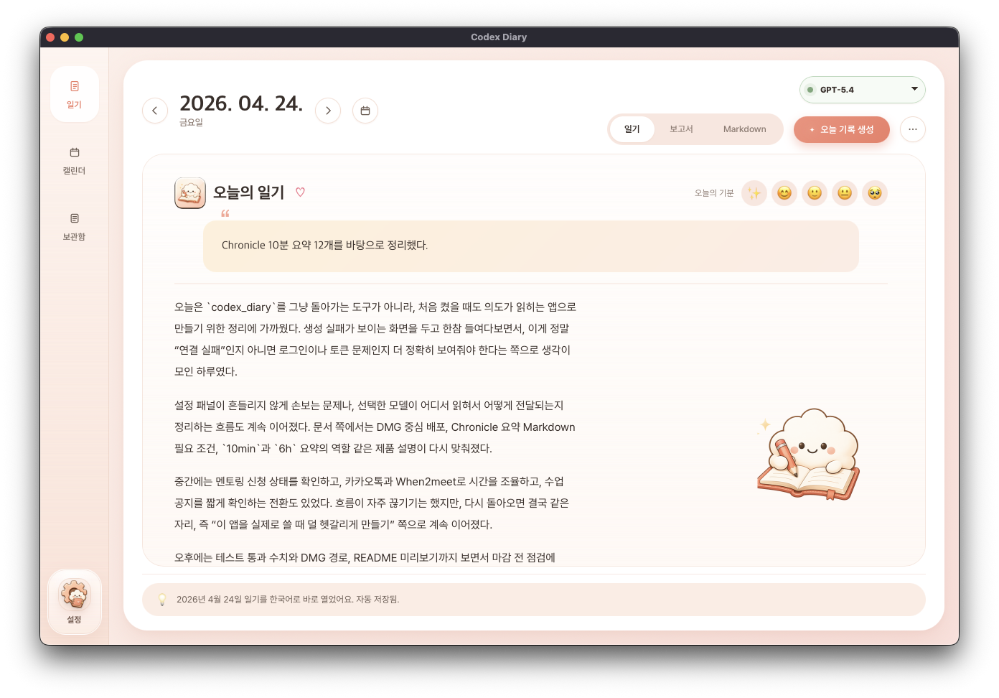
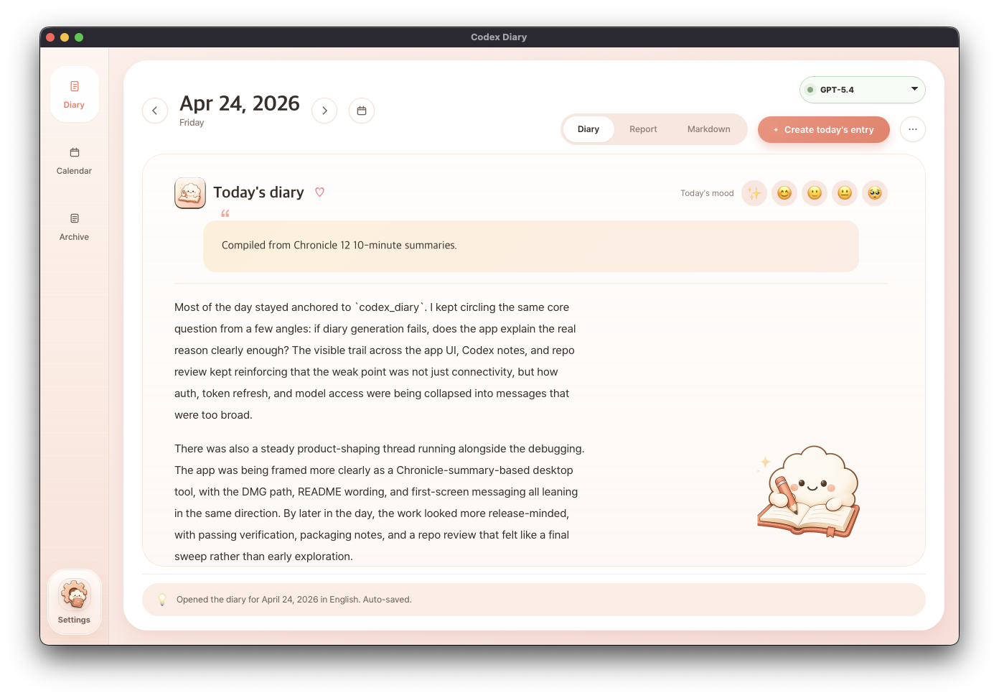
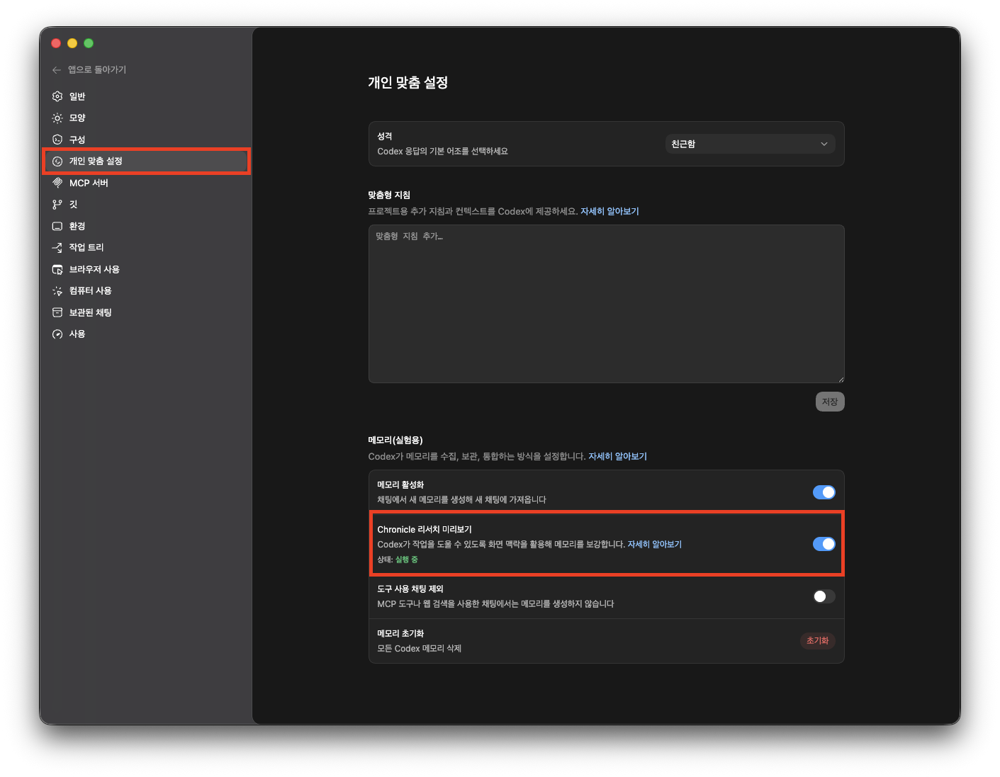

<p align="center">
  
  
</p>

[한국어](README.md) | [English](README.en.md)

# codex-diary

Chronicle Markdown 요약을 하루 작업 보고서와 일기형 회고로 바꿔 주는 로컬 앱입니다.

**모델 안내: `gpt-5.5`를 사용하려면 최신 Codex CLI가 필요합니다. 구버전에서 실패하면 `brew upgrade --cask codex`로 Codex를 업데이트한 뒤 앱을 다시 열어 주세요.**

## 요구 사항

- macOS Apple Silicon
- Homebrew
- 로컬 `codex` CLI 설치 및 `codex login` 완료
- `gpt-5.5` 사용 시 Codex CLI 최신 버전 권장
- Codex 설정에서 Chronicle 활성화
- `~/.codex/memories_extensions/chronicle/resources` 아래 Chronicle Markdown 요약 존재

Codex Diary는 Chronicle 요약 Markdown만 읽습니다. 원본 화면 녹화, 스크린샷, OCR JSONL, 이미지는 직접 처리하지 않습니다.

## Chronicle 켜기

일기를 만들기 전에 Codex 설정에서 `Chronicle 리서치 미리보기`를 켜 주세요.



## 설치

처음 설치:

```bash
brew tap coldmans/codex-diary https://github.com/coldmans/codex_diary
brew install --cask codex-diary
```

설치 후 `Codex Diary.app`을 열고, 필요하면 Codex를 연결한 뒤 날짜를 선택해서 일기를 생성하면 됩니다.

업데이트:

```bash
brew update
brew upgrade --cask codex-diary
```

이미 설치한 적이 있고 처음부터 다시 확인하고 싶다면:

```bash
brew uninstall --cask codex-diary --force
brew untap coldmans/codex-diary
brew tap coldmans/codex-diary https://github.com/coldmans/codex_diary
brew install --cask codex-diary
```

설치 후 macOS가 앱을 막으면 아래 명령을 한 번 실행한 뒤 다시 열어 주세요.

```bash
xattr -dr com.apple.quarantine "/Applications/Codex Diary.app"
```

## 개인정보와 데이터 흐름

- 앱은 Chronicle Markdown 요약만 읽고, 원본 녹화/이미지/OCR 파일은 직접 처리하지 않습니다.
- 일기 생성 시 선택 날짜의 Chronicle 요약에서 추출한 내용이 민감정보 마스킹을 거친 뒤 로컬 `codex` CLI로 전달됩니다.
- 생성된 일기와 앱 메모/할 일은 사용자의 Mac에 평문으로 저장됩니다. 기본 앱 출력 위치는 `~/Library/Application Support/Codex Diary/diary`입니다.
- 공개 스크린샷이나 공유용 일기는 저장 전에 한 번 더 확인해 주세요.

## 생성 결과

- 날짜별 Markdown 일기 파일
- 작업 보고서 보기와 일기형 보기
- Chronicle 요약 기반 시간순 메모
- 내일 할 일과 짧은 회고
- 앱 설정에 따른 다국어 출력

Chronicle `10min` 요약을 우선 사용하고, `6h` 요약은 보조 컨텍스트로만 사용합니다. 하루 경계는 기본적으로 로컬 시간 `04:00`이며, `00:00`부터 `03:59`까지의 활동은 전날 일기에 포함됩니다.

## CLI

Homebrew Cask는 데스크톱 앱만 설치합니다. CLI는 저장소를 직접 클론하거나 Python 패키지로 설치한 개발/고급 사용자용입니다.

```bash
codex-diary --date 2026-04-21
codex-diary --date 2026-04-21 --output-language ko
codex-diary --date 2026-04-21 --length very-long
codex-diary --date 2026-04-21 --codex-model gpt-5.5
codex-diary --source-dir ~/.codex/memories_extensions/chronicle/resources
codex-diary --out-dir ./custom-output --day-boundary-hour 4
```

주요 옵션:

- `--date YYYY-MM-DD`
- `--source-dir <path>`
- `--out-dir <path>`
- `--dry-run`
- `--day-boundary-hour <0-23>`
- `--language <code>` 또는 `--output-language <code>`
- `--length short|medium|long|very-long`
- `--codex-model <model>`

## 개발

```bash
python3 -m venv .venv
source .venv/bin/activate
pip install -e .
python3 -m codex_diary.app
```

## 검증

```bash
python3 -m unittest discover -s tests -v
node --check codex_diary/ui/app.js
python3 -m compileall codex_diary
```
